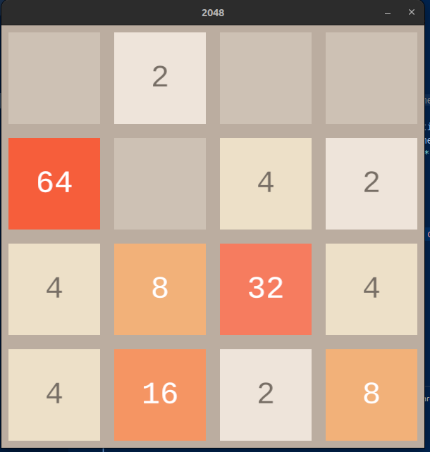
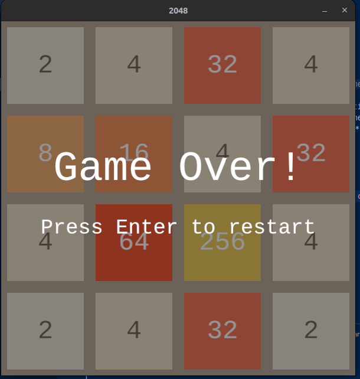

# Rust_2048_game
Welcome to the 2048 Game built with Rust! 🎮🚀

This project is a Rust implementation of the popular 2048 sliding tile puzzle game. It showcases Rust's performance, simplicity, and modern tooling to deliver a fun and interactive gaming experience.

- Rust (latest stable version)
- Cargo package manager

## Screenshots
### Gameplay


### Game Over


## How to Run

1. Clone the repository
2. Navigate to the project directory
3. Run the game:

```bash
cargo run --release
```

## How to Play

- Use arrow keys to move tiles
- Tiles with the same number merge when they collide
- The goal is to create a tile with the number 2048
- Game over when no more moves are possible

## Controls

- ↑: Move tiles up
- ↓: Move tiles down
- ←: Move tiles left
- →: Move tiles right

## Benchmarks

To run the benchmarks, use the following command:

```bash
cargo bench
```

### Benchmark Results
Our game's core operations have been benchmarked using Criterion.rs. The results are as follows:

#### Movement Operations
- Empty Grid Move (Right): ~11.3ns
- Full Grid Move (Right): ~11.6ns

These results show that the movement operations are efficient and perform well even with a full grid.

#### Game Over Check
- Empty Grid Game Over Check: ~5.5ns
- Full Grid Game Over Check: ~28.3ns

The game over detection is significantly faster on empty grids compared to full grids which is expected as the algorithm can return early when empty cells are found.

### Analysis
- Movement operations maintain consistent performance regardless of the grid's state.
- Game over checks are optimized to be faster on non-full grids.
- All core operations complete under 30 nanoseconds, ensuring smooth gameplay.

Note: These benchmarks are performed on a single-threaded environment. In a multi-threaded environment, the performance may vary.